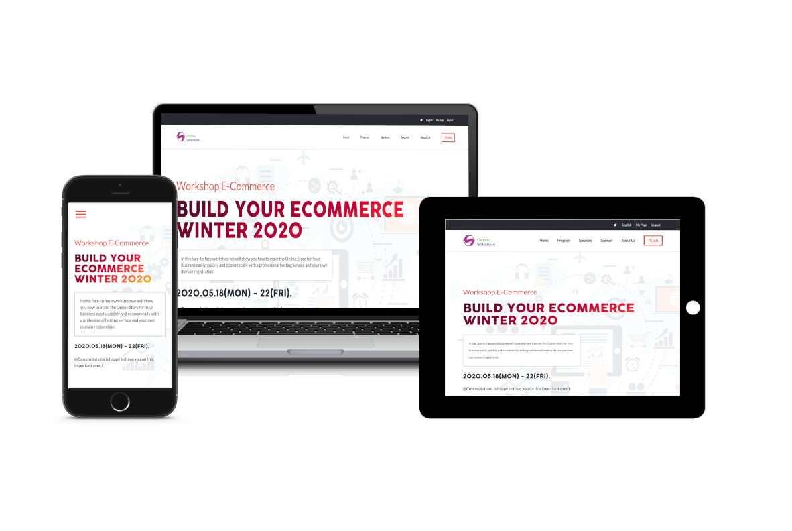
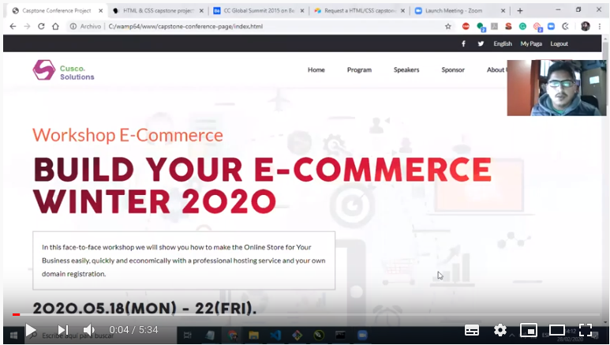

<p align="center">
    
</p>

<p align="center">
    <h1 align="center"> Conference Page</h1>    
</p>

<p align="center">
    <h2 align="center"> Building a capstone project for a conference page as a part of HTML & CSS path</h2>    
</p>


<p align="center">
    <a href="https://img.shields.io/badge/Microverse-blueviolet" alt="Contributors">
        </a>
    <a href="https://developer.mozilla.org/es/docs/HTML/HTML5" alt="HTML">
        </a>
    <a href="https://www.w3schools.com/css/" alt="CSS">
        </a>
    <a href="https://www.w3schools.com/css/css3_flexbox.asp" alt="FlexBox">
        </a>
    <a href="https://www.w3schools.com/html/html_responsive.asp" alt="Responsive">
        </a>
    <a href="https://fontawesome.com/" alt="FontAwesome">
        </a>
    <a href="https://sass-lang.com/" alt="SASS">
        </a>
</p>

  <p align="center">    
    <br />
    <a href="https://github.com/rubenpazch/capstone-conference-page"><strong>Explore this project »</strong></a>
    <br />
    <br />&#10023;
    <a href="https://compassionate-nightingale-93193a.netlify.com//">View Demo</a>   &#10023;  
    <a href="https://github.com/rubenpazch/capstone-conference-page/issues">Report Bug</a>    &#10023;
    <a href="#Getting-Started">Getting Started</a> &#10023; <a href="#Install">Installing</a> &#10023;        
    <a href="#Whats-is-included-on-this-project">Whats is included on this project</a> &#10023;        
    <a href="#Video-Presentation-of-the-project">Video Presentation of the project</a> &#10023;
    <a href="#Authors">Author</a> &#10023;
     
     
  </p>


<br/>

Conference Page is a static site developed using <b>HTML, CSS, Javascript, SASS, Font Awesome</b>,  it was used <b>FlexBox</b> to build the layout from the entire website. To build this site it was given an initial design and some basic specifications from the client, the content of this project were personalized for a Workshop E-commerce if a company wants to promote an event for a conference, congress or any activity related with education, they can use this site, there is a section to show information some general information,  show all program information, featured speakers, partners, tickers.
<br/>


<br/>


## Getting Started

This project was built using HTML, CSS, Flexbox, Javascript, it is a web application and for running on your local environment you should follow these guidelines.


### Prerequisites

- FontAwesome
- SASS


### Built With

Concepts used on this project

- HTML
- CSS
- SASS
- Javascript
- font-awesome


### Setup

The project repository can be found in [GitHub link](https://github.com/rubenpazch/capstone-conference-page) or just clone the project using this command. 


```
Using SSH 

# git clone  https://github.com/rubenpazch/capstone-conference-page.git

Using HTTPS

# git clone  git@github.com:rubenpazch/capstone-conference-page.git

```

+ Open terminal on your workspace with

```
cd /home/workspace/capstone-conference-page
```


## Install


To get started with the app, clone the repo, and to change the css style run:

```
# sass --watch css:scss
```

Change files located on SCSS folder

### Usage

To watch the local version of this project check on your browser the  index file


### SASS structure

For this project, I use SASS for managing CSS behavior and have the next structure.

* CSS
* fonts
* img
* js
* scss


### Tools used on this project

- Stickler CI
- Visual Studio Code
- CSS Formatter
- Stylelint


## Whats is included on this project

This project includes the next parts:

+ The home page
  + Cover section
  + Main program section
  + Featured speakers
  + Partner section
  + Footer
+ About page
  + Cover section
  + Workshop Ecommerce and logo section
  + Previous events
  + Partner section
  + Footer
+ Tickets page
  + Select tickets
  + Select your lunch
  + Footer


## Link to assignment

the assignment can be found  [here](https://www.notion.so/HTML-CSS-capstone-project-Conference-page-ed3efca4b9824484a9df7f9f24067ff7).


### Video Presentation of the project

You can see the video presentation on the next link [here](https://www.youtube.com/watch?v=4a5Yf33ODfQ).




## Authors

👤 **Ruben Paz Chuspe**

- Github: [@rubenpazch](https://github.com/rubenpazch)
- Linkedin: [rubenpch](https://www.linkedin.com/in/rubenpch/)
- Twitter: [rubenpch](https://www.linkedin.com/in/rubenpch/)

## Contributing

This is an education project as a part of the Microverse so contributing is not accepted.

Contributions, issues and feature requests are welcome!

Feel free to check the [issues](https://github.com/rubenpazch/capstone-conference-page/issues).

## Show your support

Give a ⭐️ if you like this project!

## Acknowledgements

+ [Microverse](https://www.microverse.org/).
+ [Github](http://github.com/).
+ [Fontawesome](http://fontawesome.com/).
+ [The Odin Project](theodinproject.com/).
+ [Creative Commons](https://creativecommons.org/licenses/by-nc/4.0/).

## License

For this project we use a template from [Creative Commons](https://creativecommons.org/licenses/by-nc/4.0/).

This project is [MIT](lic.url) licensed.
